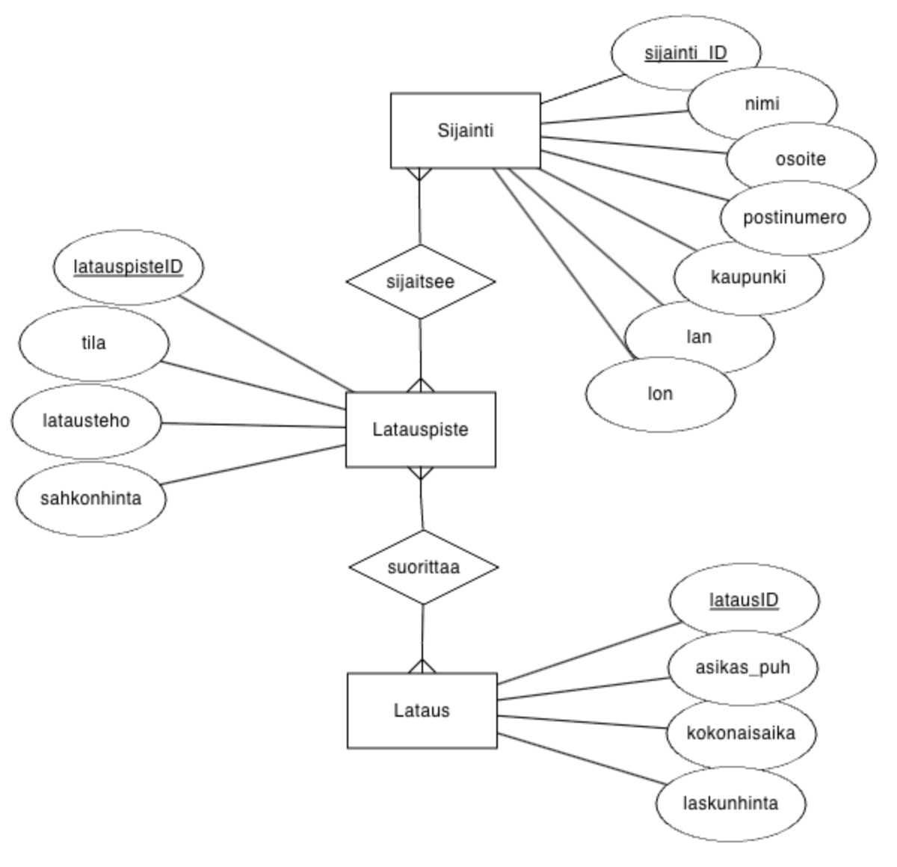

# EcoPlug

## Introduction

Welcome to EcoPlug, an open-source electric vehicle (EV) charging system! This project aims to provide a scalable and efficient solution for managing EV charging stations. The system allows users to locate charging stations, view their details, and perform charging transactions seamlessly.

### Table of Contents
1. [Database Setup](#1-database-setup)
2. [Clone the Repository](#2-clone-the-repository)
3. [Create Environment File](#3-create-environment-file)
4. [Install Dependencies and Run the Server](#4-install-dependencies-and-run-the-server)
5. [Twilio Integration](#5-twilio)


### 1. Database Setup

#### ER Diagram



The database consists of the following tables:

- **Sijainti**: Represents the charging station locations.
- **Sijaitsee**: Relates charging station locations to charging points.
- **Latauspiste**: Describes the charging points with their specifications.
- **Suorittaa**: Connects charging points with charging transactions.
- **Lataus**: Records information about charging transactions.

To set up the database, run the following queries in your MariaDB:

Open terminal and login to mysql:
```sql
mysql
```

Create a new user:
```sql
-- Replace 'new_user' and 'password' with your desired username and password
CREATE USER 'new_user'@'localhost' IDENTIFIED BY 'password';
```

Grant all privileges to the new user:
```sql
GRANT ALL PRIVILEGES ON *.* TO 'new_user'@'localhost' WITH GRANT OPTION;
```
Flush privileges to apply the changes:
```sql
FLUSH PRIVILEGES;
```
Exit the MySQL shell:
```sql
exit;
```
Login into your new user & create the database and tables:
```sql
mysql -u new_user -p
```

```sql
-- Create database
CREATE DATABASE IF NOT EXISTS EcoPlug;
USE EcoPlug;
```
```sql
-- Create Sijainti table
CREATE TABLE IF NOT EXISTS Sijainti (
  sijainti_ID INT PRIMARY KEY,
  latitude DECIMAL(8, 4),
  longitude DECIMAL(8, 4),
  nimi VARCHAR(255),
  osoite VARCHAR(255),
  kaupunki VARCHAR(255),
  postinumero VARCHAR(255)
);
```
```sql
-- Insert sample data into Sijainti
INSERT INTO Sijainti VALUES
(1, 60.178, 24.8044, 'Tapiola Garden', 'Tapiontori 3', 'Espoo', '02100'),
(2, 60.1833, 24.8312, 'Otaniemi Innovation Hub', 'Otaniementie 9', 'Espoo', '02150'),
(3, 60.1713, 24.8281, 'Keilaniemi Park', 'Keilalahdentie 2-4', 'Espoo', '02150'),
(4, 60.2181, 24.8128, 'Sello Shopping Center', 'Leppävaarankatu 3-9', 'Espoo', '02600'),
(5, 60.1733, 24.9384, 'Oodi Central Library', 'Töölönlahdenkatu 4', 'Helsinki', '00100'),
(6, 60.1694, 24.9315, 'Kamppi Center', 'Urho Kekkosen katu 1', 'Helsinki', '00100'),
(7, 60.1673, 24.9515, 'Market Square', 'Eteläranta', 'Helsinki', '00130'),
(8, 60.2936, 24.963, 'Jumbo Center', 'Vantaanportinkatu 3', 'Vantaa', '01510'),
(9, 60.3172, 24.9636, 'Aviapolis District', 'Lentoasemantie 1', 'Vantaa', '01530'),
(10, 60.272, 25.0409, 'Myyrmanni Center', 'Iskoskuja 3', 'Vantaa', '01600');
```

```sql
-- Create Latauspiste table
CREATE TABLE IF NOT EXISTS Latauspiste (
  latauspisteID INT PRIMARY KEY,
  tila INT,
  latausteho VARCHAR(255),
  sahkonhinta DECIMAL(4, 2),
  parkki VARCHAR(255)
);
```

```sql
-- Insert sample data into Latauspiste
INSERT INTO Latauspiste VALUES
(1, 1, 'Type2', 0.22, 'A509'),
(2, 1, 'CCS', 0.5, 'B301'),
(3, 1, 'Type2', 0.22, 'C102'),
(4, 1, 'CCS', 0.5, 'D205'),
(5, 1, 'Type2', 0.22, 'E407'),
(6, 1, 'CCS', 0.5, 'F309'),
(7, 1, 'Type2', 0.22, 'G213'),
(8, 1, 'CCS', 0.5, 'H112'),
(9, 1, 'Type2', 0.22, 'I415');
```

```sql
-- Create Lataus table
CREATE TABLE IF NOT EXISTS Lataus (
  latausID INT PRIMARY KEY,
  kokonaisaika INT,
  laskunhinta INT,
  asiakas_puh VARCHAR(255)
);
```

```sql
-- Insert sample data into Lataus
INSERT INTO Lataus VALUES
(1, 30, 30, '+358400977099'),
(2, 0, 0, '00000'),
(3, 0, 0, '+35848484848'),
(4, 0, 0, '+358442379461'),
(5, 0, 0, '+358442379461'),
(6, 0, 0, '+358442379461'),
(7, 0, 0, '+358442379461');
```


```sql
-- Create sijaitsee table
CREATE TABLE IF NOT EXISTS sijaitsee (
  sijainti_ID INT,
  latauspisteID INT,
  PRIMARY KEY (sijainti_ID, latauspisteID),
  FOREIGN KEY (sijainti_ID) REFERENCES Sijainti(sijainti_ID),
  FOREIGN KEY (latauspisteID) REFERENCES Latauspiste(latauspisteID)
);
```

```sql
-- Insert sample data into sijaitsee
INSERT INTO sijaitsee VALUES
(1, 1),
(1, 2),
(1, 3),
(1, 4),
(1, 5),
(1, 6);
```

```sql
-- Create suorittaa table
CREATE TABLE IF NOT EXISTS suorittaa (
  latauspisteID INT,
  latausID INT,
  PRIMARY KEY (latauspisteID, latausID),
  FOREIGN KEY (latauspisteID) REFERENCES Latauspiste(latauspisteID),
  FOREIGN KEY (latausID) REFERENCES Lataus(latausID)
);
```

```sql
-- Insert sample data into suorittaa
INSERT INTO suorittaa VALUES
(2, 1),
(3, 2),
(4, 3),
(5, 4),
(6, 5);
```

### 2. Clone the Repository

```bash
git clone https://github.com/MuathOthman/EcoPlugBackend
```

### 3. Create Environment File

Create a .env file in the root of the project and add the following configurations:

```bash
TWILIO_ACCOUNT_SID=your_twilio_account_sid
TWILIO_AUTH_TOKEN=your_twilio_auth_token
SID=your_twilio_sid

DB_Docker_Container=your_db_docker_container_name
DB_HOST=your_db_host
DB_PORT=your_db_port
DB_USER=your_db_username
DB_PASSWORD=your_db_password
DB_DATABASE=your_db_name
```
### 4. Install Dependencies and Run the Server

#### For Mac:

```bash
# Change directory to the EcoPlugBackend folder
cd EcoPlugBackend

# Install Node.js (if not installed)
brew install node

# Install project dependencies
npm install

# Run the server in development mode
npm run dev
```
### 5. Twilio

Get a twilio account , authentic token and sid for the .env file.
here is a full tutorial how to do it: 

[Twilio Tutorial](https://www.youtube.com/watch?v=-mKz-TnziXA&t=322s)
